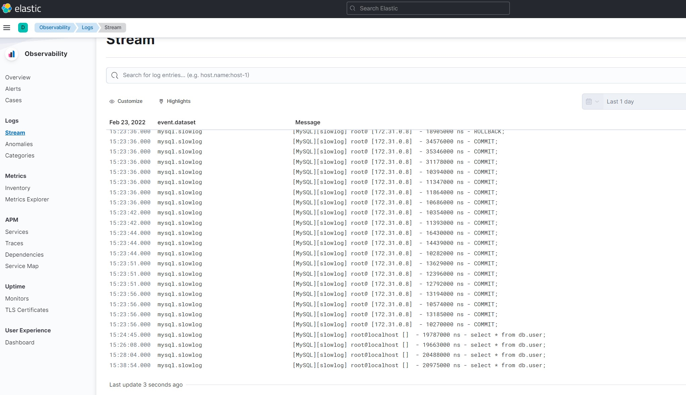
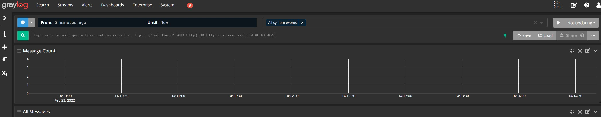

## ELK/GrayLog

## Setup

1. Install docker
2. Install siege

### Steps to run

`docker-compose up --build` 

### Siege to fill in the db - run several times

`siege -c200 -t120S --content-type "application/json" 'http://localhost:8000/users POST {}'`

### Connect to db container

`mysql -uroot -ppassword`
`select * from db.users`

### Kibana
 
 Go to http://localhost:5601/app/logs/

### Graylog 

Go to http://localhost:9000/

   
